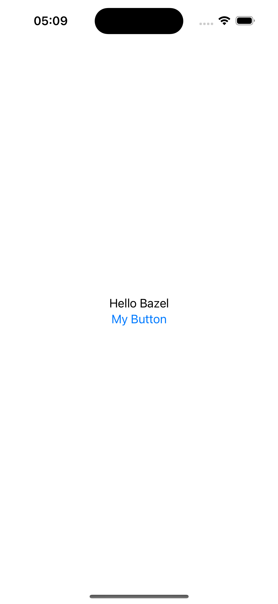

# Random Quote Android and iOS App Bazel Workspace
Monorepo of a Random Quote for Android and iOS App

## Purpose

This project aims to demonstrate the viability of using Bazel as a build management tool. While Bazel is an excellent choice for managing builds, it is particularly recommended for larger teams that frequently reuse modules and require collaborative workflows. 

The development of this project was guided by a YouTube playlist, which can be found [here](https://www.youtube.com/playlist?list=PL23Revp-82LK5Xvy_iQYScLZ6zIyBGZmX).

## Apps

| Android    | iOS |
| -------- | ------- |
|   |     |

## Commands

### iOS

#### Generating XCode Project to develop

```
bazel run //ios-random-quote:xcodeproj
```

#### Running App

```
bazel build //ios-random-quote:iosapp
bazel run //ios-random-quote:iosapp
```

#### Testing App

```
bazel build //ios-random-quote:iostests
bazel test //ios-random-quote:iosapp
```

### Android

### Preparing your Android Studio

1. Step One

Verify last version compatible of Android Studio for  Bazel Plugin

link: https://plugins.jetbrains.com/plugin/9185-bazel-for-android-studio

2. Step Two

Download Android Studio compatible at archive

Last knowledged: `Android Studio — Jellyfish | 2023.3.1` — `Jellyfish | 2023.3.1 Patch 2`

https://developer.android.com/studio/archive

3. Click on import Bazel Project

4. Choose the root of bazel workspace

5. Chosse `Create from scratch`

6. Fill the fields to look like

```
directories:
  # Add the directories you want added as source here
  # By default, we've added your entire workspace ('.')
  android-random-quote

# Automatically includes all relevant targets under the 'directories' above
derive_targets_from_directories: true

targets:
  # If source code isn't resolving, add additional targets that compile it here
  //android-random-quote/app/src:androidapp

additional_languages:
  # Uncomment any additional languages you want supported
  # c
  # dart
  kotlin
  # python


# Please uncomment an android-SDK platform. Available SDKs are:
android_sdk_platform: android-32
# android_sdk_platform: android-34
```

7. Click on `create`

8. Add Configurations for build and mobile-install

| Build    | Mobile-Install |
| -------- | ------- |
|   |     |


9. Happy Code!

#### Running App

```
bazel build //android-random-quote/app/src:androidapp --java_runtime_version=remotejdk_11
bazel mobile-install //android-random-quote/app/src:androidapp --java_runtime_version=remotejdk_11

```

### Check Verbose Error

```
--verbose_failures 
```
